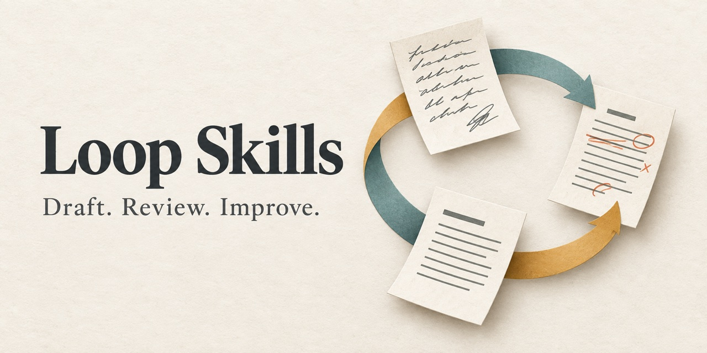

# Loop Skills · 把草稿改到有依据

<p align="center"></p>

![version][version-badge] ![license][license-badge] ![type][type-badge]

[English](README.en.md) | 中文 · [共同方法](LOOP-PATTERN.md) · [发行状态与历史评审](REVIEW-CANDIDATES.md) · [版本记录](CHANGELOG.md)

把一次性生成变成可检查的写作闭环：先确认材料和目标，再起草、逐项评审，按问题修订，到达上限就把剩余问题交还给你。

本系列围绕内容创作、求职准备和关键对话，采用共同的生成、评审与修订流程。截至 2026-09-21，以下 9 件均已正式公开发布；各件独立，完整用法、评测和限制以对应版本的文档为准。正式发布不等于全量回归、跨宿主验证或实际效果保证。

## 已发布项目

| Skill | 用来做什么 | 固定版本 | Stars |
| --- | --- | --- | --- |
| [Article Writer][article] | 给中文观点长文检查立场、结构与事实，再按需要修订 | [v0.3.0][article-release] | [![Article stars][article-stars]][article] |
| [Report Writer][report] | 从真实成果账本整理周报、述职和晋升材料 | [v0.3.1][report-release] | [![Report stars][report-stars]][report] |
| [Script Writer][script-writer] | 给中文口播脚本检查钩子、时长与事实，再按需要修订 | [v0.3.1][script-writer-release] | [![Script Writer stars][script-writer-stars]][script-writer] |
| [Decision][decision] | 整理难逆决策的证据、红队、止损与备忘录 | [v0.3.1][decision-release] | [![Decision stars][decision-stars]][decision] |
| [Content Audit][content-audit] | 诊断已发布内容的证据、归因与改进方向 | [v0.3.1][content-audit-release] | [![Content Audit stars][content-audit-stars]][content-audit] |
| [Resume Writer][resume-writer] | 以真实经历整理中文简历、求职信与岗位匹配 | [v0.3.4][resume-writer-release] | [![Resume Writer stars][resume-writer-stars]][resume-writer] |
| [Negotiation][negotiation] | 准备谈薪与关键对话，明确底线、替代方案与模拟边界 | [v0.4.2][negotiation-release] | [![Negotiation stars][negotiation-stars]][negotiation] |
| [Topic Picker][topic-picker] | 按受众问题筛选选题，检查热度证据并交付 Topic Brief | [v0.4.1][topic-picker-release] | [![Topic Picker stars][topic-picker-stars]][topic-picker] |
| [Interview Writer][interview-writer] | 基于真实经历准备口述答案、故事库与面试追问 | [v0.2.3][interview-writer-release] | [![Interview Writer stars][interview-writer-stars]][interview-writer] |

## 发行状态与历史评审

[发行状态与历史评审目录](REVIEW-CANDIDATES.md) 列出九件当前固定版本及各自证据限制，并保留此前五个候选的固定提交与历史 HOLD。旧候选不因后续版本发布而改判通过，也不作为当前安装入口。

本次索引整合只核对公开 Release、版本身份与文档，不新增模型测试。历史首轮、定向复测、实际用户回合与单次调用内模拟分别记账，不将旧版本成绩移给新版本；记录中的模型名称也不等于独立后台身份认证。

## 选择与安装

1. 在上表选择所需产品，打开固定版本的 README 安装说明。
2. 区分文档中的安装说明与实际已验证的宿主范围，使用对应的项目级安装方式。这个索引仓无需安装，不包含 `SKILL.md`。
3. 开启新会话，运行对应 README 的最小示例。先确认模式、事实边界和输出符合需要，再用于自己的材料。

例如，Article 的 QA Only 模式可以先诊断一句空泛的观点；Report 的素材整理模式先把“12 个接口完成 9 个、3 个等待环境”记成账本。具体检查方法与实际结果见各仓评测记录。

## 共同方法

```text
确认目标与材料 → 初稿 → 逐项评审 → 修订 → 达标或停下并列出剩余问题
```

评分帮助定位问题，不代表事实已经核实，也不是效果保证。各件的前置条件、评分表、轻量模式和停止规则不同；[Loop Pattern](LOOP-PATTERN.md) 解释共同思路。

## 边界与路线

- Skill 是给模型宿主读取的文本指令；具体执行效果取决于宿主、输入和人工复核。
- 各仓分别披露测试环境、通过范围和已知限制。安装成功、模型行为通过、真人认可分别判断。
- 使用脱敏材料；模型宿主可能保留输入和输出。第三方徽章会向其服务请求公开仓库信息。
- 已发布项目表使用固定 Release；默认分支可能与发行标签不同，安装以所选版本为准。历史评审入口只用于追溯，不替代当前版本文档。
- 反馈功能问题时，到对应项目提供脱敏的最小复现。索引问题可在本仓提出。

## 许可

[MIT](LICENSE) · Steven CHAN。每件 Skill 的许可及第三方来源说明以各自仓库为准。

[version-badge]: https://img.shields.io/badge/version-0.1.0-blue?style=flat-square
[license-badge]: https://img.shields.io/badge/license-MIT-green?style=flat-square
[type-badge]: https://img.shields.io/badge/type-skill%20index-orange?style=flat-square
[article]: https://github.com/steven-pku/loop-article-writer
[report]: https://github.com/steven-pku/loop-report-writer
[article-release]: https://github.com/steven-pku/loop-article-writer/releases/tag/v0.3.0
[report-release]: https://github.com/steven-pku/loop-report-writer/releases/tag/v0.3.1
[article-stars]: https://img.shields.io/github/stars/steven-pku/loop-article-writer?style=social
[report-stars]: https://img.shields.io/github/stars/steven-pku/loop-report-writer?style=social

[script-writer]: https://github.com/steven-pku/loop-script-writer
[script-writer-release]: https://github.com/steven-pku/loop-script-writer/releases/tag/v0.3.1
[script-writer-stars]: https://img.shields.io/github/stars/steven-pku/loop-script-writer?style=social

[decision]: https://github.com/steven-pku/loop-decision
[decision-release]: https://github.com/steven-pku/loop-decision/releases/tag/v0.3.1
[decision-stars]: https://img.shields.io/github/stars/steven-pku/loop-decision?style=social

[content-audit]: https://github.com/steven-pku/loop-content-audit
[content-audit-release]: https://github.com/steven-pku/loop-content-audit/releases/tag/v0.3.1
[content-audit-stars]: https://img.shields.io/github/stars/steven-pku/loop-content-audit?style=social

[resume-writer]: https://github.com/steven-pku/loop-resume-writer
[resume-writer-release]: https://github.com/steven-pku/loop-resume-writer/releases/tag/v0.3.4
[resume-writer-stars]: https://img.shields.io/github/stars/steven-pku/loop-resume-writer?style=social

[negotiation]: https://github.com/steven-pku/loop-negotiation
[negotiation-release]: https://github.com/steven-pku/loop-negotiation/releases/tag/v0.4.2
[negotiation-stars]: https://img.shields.io/github/stars/steven-pku/loop-negotiation?style=social

[topic-picker]: https://github.com/steven-pku/loop-topic-picker
[topic-picker-release]: https://github.com/steven-pku/loop-topic-picker/releases/tag/v0.4.1
[topic-picker-stars]: https://img.shields.io/github/stars/steven-pku/loop-topic-picker?style=social

[interview-writer]: https://github.com/steven-pku/loop-interview-writer
[interview-writer-release]: https://github.com/steven-pku/loop-interview-writer/releases/tag/v0.2.3
[interview-writer-stars]: https://img.shields.io/github/stars/steven-pku/loop-interview-writer?style=social
